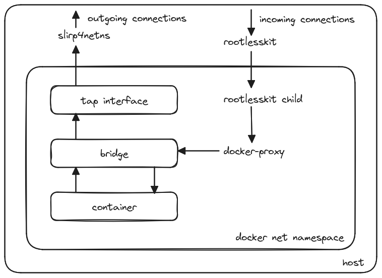

# Investigating Docker rootless mode networking

  

I have recently encountered Docker in rootless mode and decided to look at its network interfaces on the host. To my surprise, there were none, so I started to figure out how network interaction was organized inside it. I will share the results of the analysis in this article. The article assumes knowledge of Linux and of regular Docker network stack.

## Why do we need rootless mode
According to [documentation](https://docs.docker.com/engine/security/rootless/) - "Rootless mode allows running the Docker daemon and containers as a non-root user to mitigate potential vulnerabilities in the daemon and the container runtime. Rootless mode does not require root privileges even during the installation of the Docker daemon"

## Installing docker in rootless mode
Follow [documentation](https://docs.docker.com/engine/security/rootless/) to install docker. Host OS - Ubuntu 20.04:
```shell
sudo apt-get install -y dbus-user-session uidmap slirp4netns
curl -fsSL https://get.docker.com/rootless | sh
export PATH=/home/user/bin:$PATH
systemctl --user start docker
```

## Analysis of host processes and network environment
First, let's look for docker processes. Main process `rootlesskit` spawned several child processes. `ps aux` will additionally show that these processes are started by the user named `user`:
```shell
user@rootless:~$ ps axf | grep docker -A 10
---
   8075 ?        Ssl    0:00  \_ rootlesskit --state-dir=/run/user/1001/dockerd-rootless --net=slirp4netns --mtu=65520 --slirp4netns-sandbox=auto --slirp4netns-seccomp=auto --disable-host-loopback --port-driver=builtin --copy-up=/etc --copy-up=/run --propagation=rslave /home/user/bin/dockerd-rootless.sh
   8085 ?        Sl     0:00      \_ /proc/self/exe --state-dir=/run/user/1001/dockerd-rootless --net=slirp4netns --mtu=65520 --slirp4netns-sandbox=auto --slirp4netns-seccomp=auto --disable-host-loopback --port-driver=builtin --copy-up=/etc --copy-up=/run --propagation=rslave /home/user/bin/dockerd-rootless.sh
   8105 ?        Sl     0:00      |   \_ dockerd
   8120 ?        Ssl    0:00      |       \_ containerd --config /run/user/1001/docker/containerd/containerd.toml
   8097 ?        S      0:00      \_ slirp4netns --mtu 65520 -r 3 --disable-host-loopback --enable-sandbox --enable-seccomp 8085 tap0
```
Now check the network environment. There are no traces of Docker - no Docker bridges are available, there are no iptables rules either:
```shell
user@rootless:~$ ip a
---
1: lo: <LOOPBACK,UP,LOWER_UP> mtu 65536 qdisc noqueue state UNKNOWN group default qlen 1000
    link/loopback 00:00:00:00:00:00 brd 00:00:00:00:00:00
    inet 127.0.0.1/8 scope host lo
       valid_lft forever preferred_lft forever
    inet6 ::1/128 scope host 
       valid_lft forever preferred_lft forever
2: enp1s0: <BROADCAST,MULTICAST,UP,LOWER_UP> mtu 1500 qdisc fq_codel state UP group default qlen 1000
    link/ether 52:54:00:9a:0c:7e brd ff:ff:ff:ff:ff:ff
    inet 192.168.122.49/24 brd 192.168.122.255 scope global dynamic enp1s0
       valid_lft 2349sec preferred_lft 2349sec
    inet6 fe80::5054:ff:fe9a:c7e/64 scope link 
       valid_lft forever preferred_lft forever
       
user@rootless:~$ ip rule
---
0:	from all lookup local
32766:	from all lookup main
32767:	from all lookup default

user@rootless:~$ ip r
---
default via 192.168.122.1 dev enp1s0 proto dhcp src 192.168.122.49 metric 100 
192.168.122.0/24 dev enp1s0 proto kernel scope link src 192.168.122.49 
192.168.122.1 dev enp1s0 proto dhcp scope link src 192.168.122.49 metric 100

user@rootless:~$ sudo iptables-save
# Generated by iptables-save v1.8.4 on Sun Mar 10 16:54:51 2024
*nat
:PREROUTING ACCEPT [0:0]
:INPUT ACCEPT [0:0]
:OUTPUT ACCEPT [0:0]
:POSTROUTING ACCEPT [0:0]
COMMIT
# Completed on Sun Mar 10 16:54:51 2024
# Generated by iptables-save v1.8.4 on Sun Mar 10 16:54:51 2024
*filter
:INPUT ACCEPT [59111:116799888]
:FORWARD ACCEPT [0:0]
:OUTPUT ACCEPT [45917:5706873]
COMMIT
# Completed on Sun Mar 10 16:54:51 2024
```

## Docker network namespace. Access to the outside
Let's find network namespace used by docker (`docker_net_ns` further on) - we see docker child process with pid 8085 running in its own network namespace:
```shell
user@rootless:~$ sudo lsns -t net
---
        NS TYPE NPROCS   PID USER    NETNSID NSFS COMMAND
4026531992 net     125     1 root unassigned      /sbin/init
4026532352 net       3  8085 user unassigned      /proc/self/exe --state-dir=/run/user/1001/dockerd-rootless --net=sli
```
Now go to `docker_net_ns` and look what is available there. There are standard Docker bridge `docker0` and Docker iptables rules, as well as an unusual for Docker `tap0` interface. Usually, some process is connected to  a `tap` interface, this process reads incoming packets from the interface, then somehow processes the packets and, for example, sends them further to the OS network stack (or vice versa, receives packets from the outside and passes them to the `tap` interface). OpenVPN is a good example of this approach. 

Interestingly, the default route is configured through the `tap0` interface:
```shell
user@rootless:~$ sudo nsenter -t 8085 -n bash
# docker_net_ns
root@rootless:/home/user# ip a
---
1: lo: <LOOPBACK,UP,LOWER_UP> mtu 65536 qdisc noqueue state UNKNOWN group default qlen 1000
    link/loopback 00:00:00:00:00:00 brd 00:00:00:00:00:00
    inet 127.0.0.1/8 scope host lo
       valid_lft forever preferred_lft forever
    inet6 ::1/128 scope host 
       valid_lft forever preferred_lft forever
2: tap0: <BROADCAST,MULTICAST,UP,LOWER_UP> mtu 65520 qdisc fq_codel state UP group default qlen 1000
    link/ether 32:1d:f0:be:4b:1e brd ff:ff:ff:ff:ff:ff
    inet 10.0.2.100/24 scope global tap0
       valid_lft forever preferred_lft forever
    inet6 fe80::301d:f0ff:febe:4b1e/64 scope link 
       valid_lft forever preferred_lft forever
3: docker0: <NO-CARRIER,BROADCAST,MULTICAST,UP> mtu 1500 qdisc noqueue state DOWN group default 
    link/ether 02:42:2b:35:4b:6f brd ff:ff:ff:ff:ff:ff
    inet 172.17.0.1/16 brd 172.17.255.255 scope global docker0
       valid_lft forever preferred_lft forever

root@rootless:/home/user# ip r
---
default via 10.0.2.2 dev tap0 
10.0.2.0/24 dev tap0 proto kernel scope link src 10.0.2.100 
172.17.0.0/16 dev docker0 proto kernel scope link src 172.17.0.1 
       
root@rootless:/home/user# iptables-save
---
# Generated by iptables-save v1.8.4 on Sun Mar 10 17:13:25 2024
*nat
:PREROUTING ACCEPT [0:0]
:INPUT ACCEPT [0:0]
:OUTPUT ACCEPT [1:40]
:POSTROUTING ACCEPT [1:40]
:DOCKER - [0:0]
-A PREROUTING -m addrtype --dst-type LOCAL -j DOCKER
-A OUTPUT ! -d 127.0.0.0/8 -m addrtype --dst-type LOCAL -j DOCKER
-A POSTROUTING -s 172.17.0.0/16 ! -o docker0 -j MASQUERADE
-A DOCKER -i docker0 -j RETURN
COMMIT
...
```
Pay attention to process 8097 (`slirp4netns`), which was launched with the `tap0` interface specified in the configuration `slirp4netns --mtu 65520 -r 3 --disable-host-loopback --enable-sandbox --enable-seccomp 8085 tap0`. Outgoing traffic from `docker_net_ns` goes through `tap0` (thanks to default route) and is probably processed by the `slirp4netns` process running in the host network namespace.

Let's check this guess. First, look at the descriptors used by the `slirp4netns` process. We see that the process is connected to the tun/tap device via fd (file descriptor) 6
```shell
# host
user@rootless:~$ lsof -p 8097
---
COMMAND    PID USER   FD   TYPE             DEVICE SIZE/OFF  NODE NAME
...
slirp4net 8097 user    6u   CHR             10,200     0t98   137 /dev/net/tun

```
Now run `ping 8.8.8.8` from `docker_net_ns`, and in another terminal connect to the `slirp4netns` process using `strace`. The `slirp4netns` process reads from fd 6 (tun/tap device), opens a socket on the host through which it sends an icmp packet, receives a response, processes it, writes to fd 6 and closes the socket. HTTP request `curl example.com --resolve example.com:80:93.184.216.34` from `docker_net_ns` works similarly:
```shell
# host
user@rootless:~$ strace -p 8097 -e read,socket,sendto,recvfrom,write,close
---
# ping 8.8.8.8
strace: Process 8097 attached
read(6, "RU\n\0\2\0022\35\360\276K\36\10\0E\0\0T'W@\0@\1\366\336\n\0\2d\10\10"..., 65536) = 98
socket(AF_INET, SOCK_DGRAM|SOCK_CLOEXEC, IPPROTO_ICMP) = 3
sendto(3, "\10\0<\201!:\0An\357\355e\0\0\0\0z\333\4\0\0\0\0\0\20\21\22\23\24\25\26\27"..., 64, 0, {sa_family=AF_INET, sin_port=htons(8150), sin_addr=inet_addr("8.8.8.8")}, 16) = 64
recvfrom(3, "\0\0e!\0\232\0An\357\355e\0\0\0\0z\333\4\0\0\0\0\0\20\21\22\23\24\25\26\27"..., 65500, 0, NULL, NULL) = 64
write(6, "2\35\360\276K\36RU\n\0\2\2\10\0E\0\0T\0@@\0\377\1^\365\10\10\10\10\n\0"..., 98) = 98
close(3)                                = 0   

# curl example.com --resolve example.com:80:93.184.216.34
read(6, "RU\n\0\2\0022\35\360\276K\36\10\0E\0\0<\361<@\0@\6\7A\n\0\2d]\270"..., 65536) = 74
socket(AF_INET, SOCK_STREAM|SOCK_CLOEXEC, IPPROTO_IP) = 3
sendto(3, "", 0, 0, NULL, 0)            = 0
write(6, "2\35\360\276K\36RU\n\0\2\2\10\0E\10\0,\25\202\0\0@\6#\4]\270\330\"\n\0"..., 58) = 58
read(6, "RU\n\0\2\0022\35\360\276K\36\10\0E\0\0(\361=@\0@\6\7T\n\0\2d]\270"..., 65536) = 54
read(6, "RU\n\0\2\0022\35\360\276K\36\10\0E\0\0s\361>@\0@\6\7\10\n\0\2d]\270"..., 65536) = 129
sendto(3, "GET / HTTP/1.1\r\nHost: example.co"..., 75, 0, NULL, 0) = 75
write(6, "2\35\360\276K\36RU\n\0\2\2\10\0E\10\0(\25\203\0\0@\6#\7]\270\330\"\n\0"..., 54) = 54
recvfrom(3, "HTTP/1.1 200 OK\r\nAccept-Ranges: "..., 163840, 0, NULL, NULL) = 1607
write(6, "2\35\360\276K\36RU\n\0\2\2\10\0E\10\6o\25\204\0\0@\6\34\277]\270\330\"\n\0"..., 1661) = 1661
read(6, "RU\n\0\2\0022\35\360\276K\36\10\0E\0\0(\361?@\0@\6\7R\n\0\2d]\270"..., 65536) = 54
read(6, "RU\n\0\2\0022\35\360\276K\36\10\0E\0\0(\361@@\0@\6\7Q\n\0\2d]\270"..., 65536) = 54
write(6, "2\35\360\276K\36RU\n\0\2\2\10\0E\10\0(\25\205\0\0@\6#\5]\270\330\"\n\0"..., 54) = 54
recvfrom(3, "", 163840, 0, NULL, NULL)  = 0
write(6, "2\35\360\276K\36RU\n\0\2\2\10\0E\10\0(\25\206\0\0@\6#\4]\270\330\"\n\0"..., 54) = 54
read(6, "RU\n\0\2\0022\35\360\276K\36\10\0E\0\0(\0\0@\0@\6\370\221\n\0\2d]\270"..., 65536) = 54
close(3) 
```
Now it’s clear how access to the outside from `docker_net_ns` works, but how does traffic get inside the namespace? It is clear that within the connection opened by the `slirp4netns` process traffic can go in both directions, but how to get to `docker_net_ns` after the connection is closed (as we have already seen, the host network stack is not connected to the `docker_net_ns` network stack at all)?
## docker_net_ns. Access from the outside
### docker_net_ns after container creation
Let's create a nginx container with port forwarding and see what has changed in `docker_net_ns`:
```shell
# host
user@rootless:~$ docker run -d -p 8080:80 --name nginx nginx
```
A veth device has been added inside `docker_net_ns`,
```shell
# docker_net_ns
root@rootless:/home/user# ip a

3: docker0: <BROADCAST,MULTICAST,UP,LOWER_UP> mtu 1500 qdisc noqueue state UP group default 
    link/ether 02:42:2b:35:4b:6f brd ff:ff:ff:ff:ff:ff
    inet 172.17.0.1/16 brd 172.17.255.255 scope global docker0
       valid_lft forever preferred_lft forever
    inet6 fe80::42:2bff:fe35:4b6f/64 scope link 
       valid_lft forever preferred_lft forever

7: vethf301793@if6: <BROADCAST,MULTICAST,UP,LOWER_UP> mtu 1500 qdisc noqueue master docker0 state UP group default 
    link/ether 1a:27:47:50:5b:e4 brd ff:ff:ff:ff:ff:ff link-netnsid 0
    inet6 fe80::1827:47ff:fe50:5be4/64 scope link 
       valid_lft forever preferred_lft forever
```
which is connected to the docker0 bridge,
```shell
# docker_net_ns
root@rootless:/home/user# ip -d link show dev vethf301793
7: vethf301793@if6: <BROADCAST,MULTICAST,UP,LOWER_UP> mtu 1500 qdisc noqueue master docker0 state UP mode DEFAULT group default 
```
the second part of which is probably located in nginx container.

Let's check this hypothesis. First, install the iproute2 and iputils-ping packages inside the container:
```shell
# host
user@rootless:~$ docker exec -it nginx bash
# nginx container
root@dbda1c174f6a:/# apt update

root@dbda1c174f6a:/# apt install -y iproute2 iputils-ping
```
We see that eth0@if7 in nginx container refers to interface 7 (veth) in `docker_net_ns`, and vethf301793@if6 in `docker_net_ns` refers to interface 6 in nginx container, pinging docker0 from the container goes through:
```shell
# nginx container
root@dbda1c174f6a:/# ip a      
---
1: lo: <LOOPBACK,UP,LOWER_UP> mtu 65536 qdisc noqueue state UNKNOWN group default qlen 1000
    link/loopback 00:00:00:00:00:00 brd 00:00:00:00:00:00
    inet 127.0.0.1/8 scope host lo
       valid_lft forever preferred_lft forever
6: eth0@if7: <BROADCAST,MULTICAST,UP,LOWER_UP> mtu 1500 qdisc noqueue state UP group default 
    link/ether 02:42:ac:11:00:02 brd ff:ff:ff:ff:ff:ff link-netnsid 0
    inet 172.17.0.2/16 brd 172.17.255.255 scope global eth0
       valid_lft forever preferred_lft forever

root@dbda1c174f6a:/# ping 172.17.0.1 -c 2
PING 172.17.0.1 (172.17.0.1) 56(84) bytes of data.
64 bytes from 172.17.0.1: icmp_seq=1 ttl=64 time=0.137 ms
64 bytes from 172.17.0.1: icmp_seq=2 ttl=64 time=0.080 ms
```
### tap0 and lo
Let's sniff the traffic in `docker_net_ns`. To do this, we are running tcpdump in `docker_net_ns` on the tap0 interface and making http request to port 8080 from the host, tcpdump shows nothing - traffic is not going through tap0:
```shell
# host
user@rootless:~$ curl 192.168.122.49:8080
---
<!DOCTYPE html>
<html>
<head>
<title>Welcome to nginx!</title>
<style>
html { color-scheme: light dark; }
body { width: 35em; margin: 0 auto;
font-family: Tahoma, Verdana, Arial, sans-serif; }
</style>
</head>
```
```shell
# docker_net_ns
root@rootless:/home/user# tcpdump -i tap0 -n -v
tcpdump: listening on tap0, link-type EN10MB (Ethernet), capture size 262144 bytes
```
Now sniff the lo (loopback) interface. We see that a packet with the destination address 127.0.0.1:8080 appears from it. But where does it come from?
```shell
# docker_net_ns
root@rootless:/home/user# tcpdump -i lo -n -v
tcpdump: listening on lo, link-type EN10MB (Ethernet), capture size 262144 bytes
---
20:22:53.337190 IP (tos 0x0, ttl 64, id 55902, offset 0, flags [DF], proto TCP (6), length 60)
    127.0.0.1.32920 > 127.0.0.1.8080: Flags [S], cksum 0xfe30 (incorrect -> 0xe397), seq 1059949832, win 65495, options [mss 65495,sackOK,TS val 1345564632 ecr 0,nop,wscale 7], length 0
20:22:53.337221 IP (tos 0x0, ttl 64, id 0, offset 0, flags [DF], proto TCP (6), length 60)
    127.0.0.1.8080 > 127.0.0.1.32920: Flags [S.], cksum 0xfe30 (incorrect -> 0x1691), seq 963548038, ack 1059949833, win 65483, options [mss 65495,sackOK,TS val 1345564633 ecr 1345564632,nop,wscale 7], length 0
20:22:53.337236 IP (tos 0x0, ttl 64, id 55903, offset 0, flags [DF], proto TCP (6), length 52)
    127.0.0.1.32920 > 127.0.0.1.8080: Flags [.], cksum 0xfe28 (incorrect -> 0x3d4c), ack 1, win 512, options [nop,nop,TS val 1345564633 ecr 1345564633], length 0
20:22:53.339057 IP (tos 0x0, ttl 64, id 55904, offset 0, flags [DF], proto TCP (6), length 135)
    127.0.0.1.32920 > 127.0.0.1.8080: Flags [P.], cksum 0xfe7b (incorrect -> 0x092e), seq 1:84, ack 1, win 512, options [nop,nop,TS val 1345564634 ecr 1345564633], length 83: HTTP, length: 83
	GET / HTTP/1.1
	Host: 192.168.122.49:8080
	User-Agent: curl/7.68.0
	Accept: */*
...
```
### rootlesskit and its child process in docker_net_ns
Look at ports that are open on the host. Port 8080 is opened by the main parent process `rootlesskit` (pid 8075):
```shell
# host
user@rootless:~$ ss -tunlp
Netid State  Recv-Q  Send-Q           Local Address:Port    Peer Address:Port Process                                 
...                                         
tcp   LISTEN 0       4096                   0.0.0.0:8080         0.0.0.0:*     users:(("rootlesskit",pid=8075,fd=14))                                        
tcp   LISTEN 0       4096                      [::]:8080            [::]:*     users:(("rootlesskit",pid=8075,fd=17)) 
```
Also remember that we have process 8085 running in `docker_net_ns`. Probably, the `rootlesskit` process (running in the host network namespace) receives traffic and passes it on to a child process 8085 (for example, over a unix socket), which, in turn, passes it on to the nginx container.

To test this connect from the host to both processes with strace and see how they react to `curl 192.168.122.49:8080`. We'll run strace with the `-ff` option to record the traces of all child processes that are created when processing a curl request:
```shell
sudo strace -ff -p 8075 -o log1
sudo strace -ff -p 8085 -o log2
```
The log turns out to be long, so let's look at the most important events only.

Process 8075. Accepting a new tcp connection and setting it up (fd 18):
```shell
accept4(14, {sa_family=AF_INET, sin_port=htons(45752), sin_addr=inet_addr("192.168.122.49")}, [112->16], SOCK_CLOEXEC|SOCK_NONBLOCK) = 18
epoll_ctl(4, EPOLL_CTL_ADD, 18, {EPOLLIN|EPOLLOUT|EPOLLRDHUP|EPOLLET, {u32=3970957316, u64=9194675590499663876}}) = 0
getsockname(18, {sa_family=AF_INET, sin_port=htons(8080), sin_addr=inet_addr("192.168.122.49")}, [112->16]) = 0
setsockopt(18, SOL_TCP, TCP_NODELAY, [1], 4) = 0
setsockopt(18, SOL_SOCKET, SO_KEEPALIVE, [1], 4) = 0
setsockopt(18, SOL_TCP, TCP_KEEPINTVL, [15], 4) = 0
setsockopt(18, SOL_TCP, TCP_KEEPIDLE, [15], 4) = 0
```
Opening a unix socket at `/run/user/1001/dockerd-rootless/.bp.sock`:
```shell
socket(AF_UNIX, SOCK_STREAM|SOCK_CLOEXEC|SOCK_NONBLOCK, 0) = 19
connect(19, {sa_family=AF_UNIX, sun_path="/run/user/1001/dockerd-rootless/.bp.sock"}, 43) = 0
getsockname(19, {sa_family=AF_UNIX}, [112->2]) = 0
getpeername(19, {sa_family=AF_UNIX, sun_path="/run/user/1001/dockerd-rootless/.bp.sock"}, [112->43]) = 0
```
Transferring information via a unix socket:
```shell
write(19, ">\0\0\0{\"Type\":\"connect\",\"Proto\":\"t"..., 66) = 66
```
If we look at the log of process 8085 (running in `docker_net_ns`), we can see that it listens to a unix socket (accept on fd 8) on the same path `/run/user/1001/dockerd-rootless/.bp.sock` and accepts a new  connection from fd 3:
```shell
accept4(8, {sa_family=AF_UNIX}, [112->2], SOCK_CLOEXEC|SOCK_NONBLOCK) = 3
getsockname(3, {sa_family=AF_UNIX, sun_path="/run/user/1001/dockerd-rootless/.bp.sock"}, [112->43]) = 0
```
`lsof` shows that this process does have a unix socket open with fd 8:
```shell
user@rootless:~$ lsof -p 8085
---
COMMAND  PID USER   FD      TYPE             DEVICE SIZE/OFF   NODE NAME
...
exe     8085 user    8u     sock                0,9      0t0  74439 protocol: UNIX
```
We can listen to a Unix socket using [sockdump](https://github.com/mechpen/sockdump), to do this we need to do the following:
```shell
# host
user@rootless:~$ sudo apt-get install bpfcc-tools linux-headers-$(uname -r)
user@rootless:~$ git clone https://github.com/mechpen/sockdump.git
user@rootless:~$ cd sockdump
user@rootless:~$ sudo ./sockdump.py --format string /run/user/1001/dockerd-rootless/.bp.sock
---
21:53:25.778 >>> process rootlesskit [8075 -> 8085] path /run/user/1001/dockerd-rootless/.bp.sock len 66(66)
>{"Type":"connect","Proto":"tcp4","IP":"127.0.0.1","Port":8080}21:53:25.780 >>> process exe [8085 -> 8075] path /run/user/1001/dockerd-rootless/.bp.sock len 5(5)
```
As we can see, only control information is transmitted through the unix socket (that a connection to 127.0.0.1:8080 is to be initiated), and there is no http traffic itself flowing from the nginx container.

Process 8085. It is reading control information from a unix socket, 
```shell
read(3, ">\0\0\0", 4)                   = 4
read(3, "{\"Type\":\"connect\",\"Proto\":\"tcp4\""..., 62) = 62
```
then opening and configuring a tcp connection to 127.0.0.1:8080, the details of which were transmitted via a unix socket,
```shell
socket(AF_INET, SOCK_STREAM|SOCK_CLOEXEC|SOCK_NONBLOCK, IPPROTO_IP) = 9
connect(9, {sa_family=AF_INET, sin_port=htons(8080), sin_addr=inet_addr("127.0.0.1")}, 16) = -1 EINPROGRESS (Operation now in progress)
getsockopt(9, SOL_SOCKET, SO_ERROR, [0], [4]) = 0
getpeername(9, {sa_family=AF_INET, sin_port=htons(8080), sin_addr=inet_addr("127.0.0.1")}, [112->16]) = 0
getsockname(9, {sa_family=AF_INET, sin_port=htons(41328), sin_addr=inet_addr("127.0.0.1")}, [112->16]) = 0
setsockopt(9, SOL_TCP, TCP_NODELAY, [1], 4) = 0
setsockopt(9, SOL_SOCKET, SO_KEEPALIVE, [1], 4) = 0
setsockopt(9, SOL_TCP, TCP_KEEPINTVL, [15], 4) = 0
setsockopt(9, SOL_TCP, TCP_KEEPIDLE, [15], 4) = 0
```
and at last duplicating an opened fd tcp socket (9->10), duplicating a fd unix socket (3->11) and sending a duplicate tcp socket over unix socket (sendmsg, cmsg_data=[10]):
```shell
fcntl(9, F_DUPFD_CLOEXEC, 0)            = 10
epoll_ctl(5, EPOLL_CTL_ADD, 10, {EPOLLIN|EPOLLOUT|EPOLLRDHUP|EPOLLET, {u32=3690463235, u64=9186805852923232259}}) = 0
fcntl(10, F_GETFL)                      = 0x802 (flags O_RDWR|O_NONBLOCK)
fcntl(10, F_SETFL, O_RDWR)              = 0
fcntl(3, F_DUPFD_CLOEXEC, 0)            = 11
epoll_ctl(5, EPOLL_CTL_ADD, 11, {EPOLLIN|EPOLLOUT|EPOLLRDHUP|EPOLLET, {u32=3674210307, u64=9186805852906979331}}) = 0
fcntl(11, F_GETFL)                      = 0x802 (flags O_RDWR|O_NONBLOCK)
fcntl(11, F_SETFL, O_RDWR)              = 0
sendmsg(11, {msg_name=NULL, msg_namelen=0, msg_iov=[{iov_base="dummy", iov_len=5}], msg_iovlen=1, msg_control=[{cmsg_len=20, cmsg_level=SOL_SOCKET, cmsg_type=SCM_RIGHTS, cmsg_data=[10]}], msg_controllen=24, msg_flags=0}, 0) = 5
```
Process 8075. It is receiving fd, in this process fd is written to fd 20 (cmsg_data=[20]),
```shell
getsockopt(19, SOL_SOCKET, SO_TYPE, [1], [4]) = 0
recvmsg(19, {msg_name={sa_family=AF_UNIX, sun_path="/run/user/1001/dockerd-rootless/.bp.sock"}, msg_namelen=112->43, msg_iov=[{iov_base="d", iov_len=1}], msg_iovlen=1, msg_control=[{cmsg_len=20, cmsg_level=SOL_SOCKET, cmsg_type=SCM_RIGHTS, cmsg_data=[20]}], msg_controllen=24, msg_flags=MSG_CMSG_CLOEXEC}, MSG_CMSG_CLOEXEC) = 1
```
then closing fd unix socket (19), duplicating the received fd (20->19) and setting it up,
```shell
close(19)                               = 0
fcntl(20, F_GETFL)                      = 0x2 (flags O_RDWR)
fcntl(20, F_DUPFD_CLOEXEC, 0)           = 19
fcntl(19, F_GETFL)                      = 0x2 (flags O_RDWR)
fcntl(19, F_SETFL, O_RDWR|O_NONBLOCK)   = 0
getsockopt(19, SOL_SOCKET, SO_TYPE, [1], [4]) = 0
getsockname(19, {sa_family=AF_INET, sin_port=htons(41328), sin_addr=inet_addr("127.0.0.1")}, [112->16]) = 0
getpeername(19, {sa_family=AF_INET, sin_port=htons(8080), sin_addr=inet_addr("127.0.0.1")}, [112->16]) = 0
setsockopt(19, SOL_TCP, TCP_NODELAY, [1], 4) = 0
setsockopt(19, SOL_SOCKET, SO_KEEPALIVE, [1], 4) = 0
setsockopt(19, SOL_TCP, TCP_KEEPINTVL, [15], 4) = 0
setsockopt(19, SOL_TCP, TCP_KEEPIDLE, [15], 4) = 0
```
and finally copying information from one TCP connection to the other (8075<->8085) at the kernel level:
```shell
splice(18, NULL, 24, NULL, 1048576, SPLICE_F_NONBLOCK) = 83
splice(23, NULL, 19, NULL, 83, SPLICE_F_NONBLOCK) = 83
splice(19, NULL, 22, NULL, 1048576, SPLICE_F_NONBLOCK) = 853
splice(21, NULL, 18, NULL, 853, SPLICE_F_NONBLOCK) = 853
```
Copying works as follows. We copy 1048576 bytes from fd 18 (tcp socket of process 8075, opened on the host) to fd 24 (fifo pipe for writing, connected to fd 23 - the second end of the fifo pipe in the same process for reading), in fact only 83 bytes were copied (GET request to nginx). Then we copy 83 bytes from fd 23 to fd 19 (tcp socket originally opened in `docker_net_ns` and passed to process 8075 on the host). After that we copy 853 bytes of nginx response from fd 19 to fd 18 via pipe 21<->22.

Here we can see the fifo pipe descriptors and their relationship to each other:
```shell
user@rootless:~$ sudo lsof -p 8075 +E
...
rootlessk 8075 user   21r     FIFO               0,13      0t0  82693 pipe 8075,rootlessk,22w
rootlessk 8075 user   22w     FIFO               0,13      0t0  82693 pipe 8075,rootlessk,21r
rootlessk 8075 user   23r     FIFO               0,13      0t0  82694 pipe 8075,rootlessk,24w
rootlessk 8075 user   24w     FIFO               0,13      0t0  82694 pipe 8075,rootlessk,23r
```

### Docker-proxy process
If you've been paying attention, you'll have noticed that process 8085 inside `docker_net_ns` opens a connection to 127.0.0.1:8080, but how do packets get into the nginx container? Let's see if there are processes inside `docker_net_ns` that listen to 8080. We note that a new docker-proxy process has appeared:
```shell
# docker_net_ns
root@rootless:/home/user# ss -tunlp
Netid  State   Recv-Q   Send-Q     Local Address:Port     Peer Address:Port  Process                                  
tcp    LISTEN  0        128            127.0.0.1:8080          0.0.0.0:*      users:(("docker-proxy",pid=8806,fd=5))  
tcp    LISTEN  0        128                [::1]:8080             [::]:*      users:(("docker-proxy",pid=8818,fd=5))
```
Connect to docker-proxy using strace to sniff its work. Docker-proxy accepts a connection on 127.0.0.1:8080 (fd 3) and initiates a connection to nginx container on 172.17.0.2:80 (fd 9), and then copies the request from fd 3 to fd 9 and the response from fd 9 to fd 3 at the kernel level (splice):
```shell
accept4(5, {sa_family=AF_INET, sin_port=htons(38880), sin_addr=inet_addr("127.0.0.1")}, [112->16], SOCK_CLOEXEC|SOCK_NONBLOCK) = 3
getsockname(3, {sa_family=AF_INET, sin_port=htons(8080), sin_addr=inet_addr("127.0.0.1")}, [112->16]) = 0
setsockopt(3, SOL_TCP, TCP_NODELAY, [1], 4) = 0
setsockopt(3, SOL_SOCKET, SO_KEEPALIVE, [1], 4) = 0
setsockopt(3, SOL_TCP, TCP_KEEPINTVL, [15], 4) = 0
setsockopt(3, SOL_TCP, TCP_KEEPIDLE, [15], 4) = 0
socket(AF_INET, SOCK_STREAM|SOCK_CLOEXEC|SOCK_NONBLOCK, IPPROTO_IP) = 9
connect(9, {sa_family=AF_INET, sin_port=htons(80), sin_addr=inet_addr("172.17.0.2")}, 16) = -1 EINPROGRESS (Operation now in progress)
getsockopt(9, SOL_SOCKET, SO_ERROR, [0], [4]) = 0
getpeername(9, {sa_family=AF_INET, sin_port=htons(80), sin_addr=inet_addr("172.17.0.2")}, [112->16]) = 0
getsockname(9, {sa_family=AF_INET, sin_port=htons(37900), sin_addr=inet_addr("172.17.0.1")}, [112->16]) = 0
setsockopt(9, SOL_TCP, TCP_NODELAY, [1], 4) = 0
setsockopt(9, SOL_SOCKET, SO_KEEPALIVE, [1], 4) = 0
setsockopt(9, SOL_TCP, TCP_KEEPINTVL, [15], 4) = 0
setsockopt(9, SOL_TCP, TCP_KEEPIDLE, [15], 4) = 0
splice(3, NULL, 13, NULL, 1048576, SPLICE_F_NONBLOCK) = 83
splice(12, NULL, 9, NULL, 83, SPLICE_F_NONBLOCK) = 83
splice(9, NULL, 11, NULL, 1048576, SPLICE_F_NONBLOCK) = 853
splice(10, NULL, 3, NULL, 853, SPLICE_F_NONBLOCK) = 853
```
Note that when establishing connection to nginx container in this way, information about the IP address of the packet source is lost.

### Summary
* the `rootlesskit` process (pid 8075) accepts a tcp connection on port 8080 in the host network namespace
* the `rootlesskit` process passes control information about the connection to be established to the child process `/proc/self/exe` (pid 8085) running in `docker_net_ns`. Control information is transmitted via a unix socket
* the `/proc/self/exe` process establishes a connection to 127.0.0.1:8080 (the port is opened by the new docker-proxy process), and docker-proxy connects to nginx container
* the `/proc/self/exe` process sends an open tcp socket descriptor to 127.0.0.1:8080 to the `rootlesskit` process
* the `rootlesskit` process copies data between its own socket and the network socket passed to it at the kernel level

## Why is it so difficult?
The thing is that Docker in rootless mode is launched by a regular user, which means Docker does not have the ability to create a pair of veth devices one of which is to be connected to the Docker bridge and the other put into container (as in a regular Docker) - this requires a root privilege. Docker in rootless mode creates veth devices only inside its own network namespace, connects one of them to Docker bridge and places the other in a container.

## Brief conclusions on rootless Docker network stack
Access from the Docker network namespace to the outside requires processing traffic in userspace, which can negatively affect the speed of network connection.

Access to the Docker network namespace from the host is faster, because traffic is processed at the kernel level, and relatively few operations are performed in userspace. The disadvantage to the scheme is losing the source IP address of the packet arriving to container.

